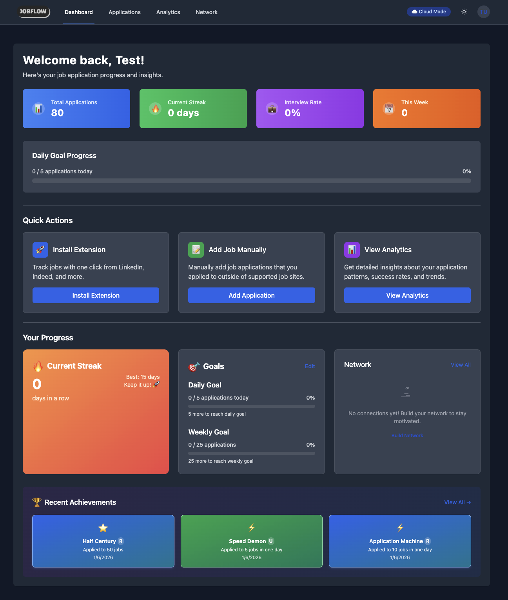
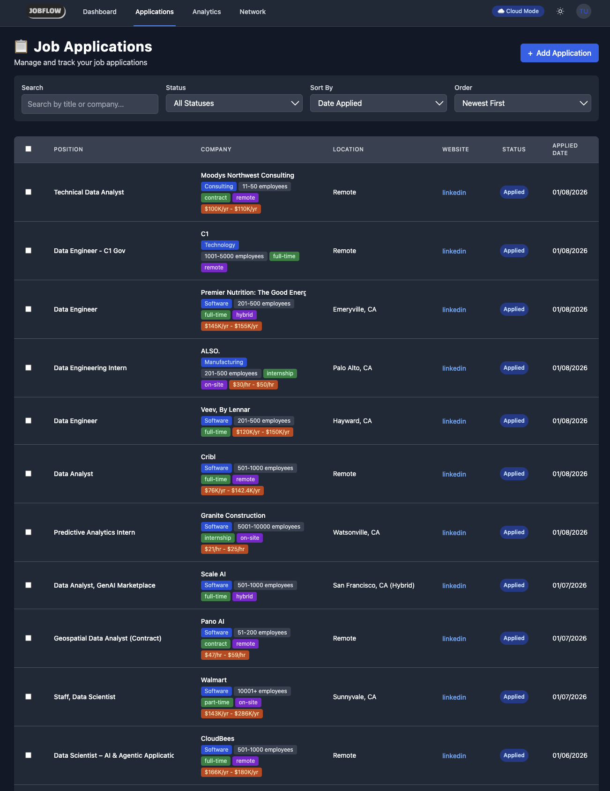
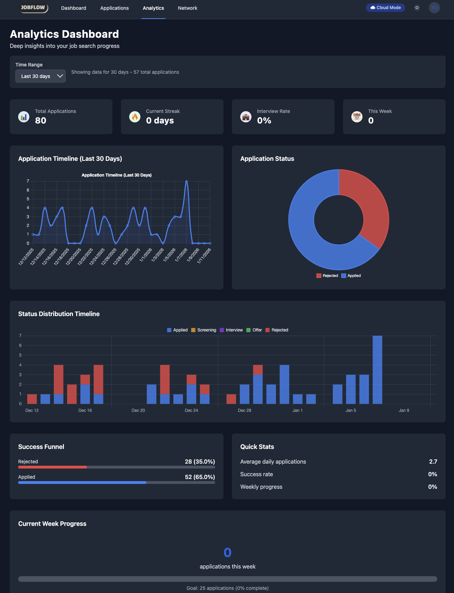
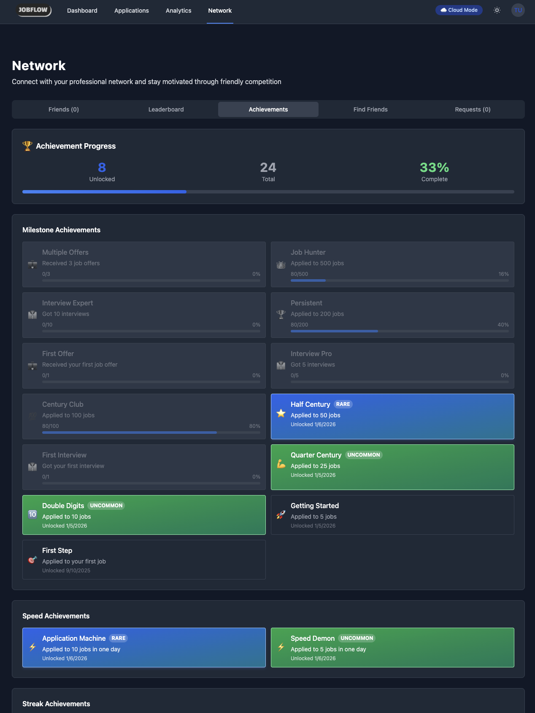
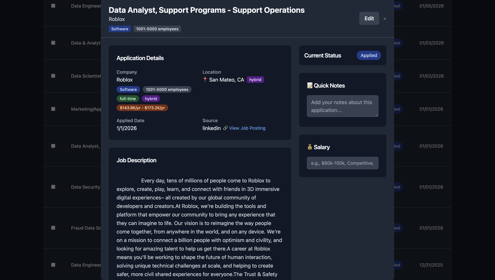
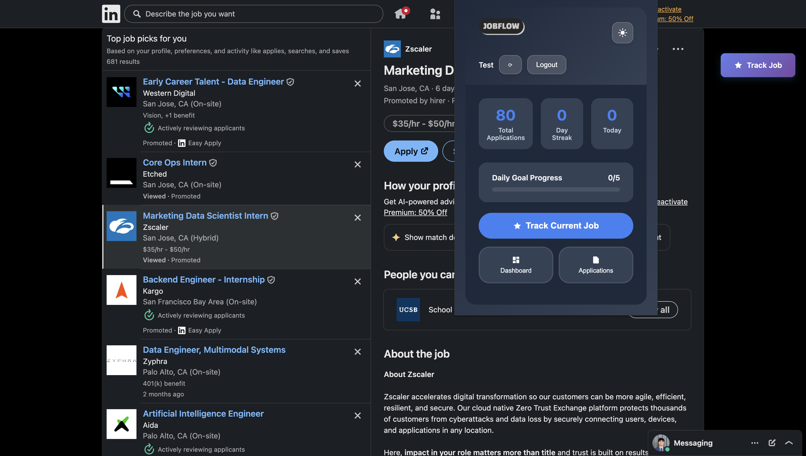
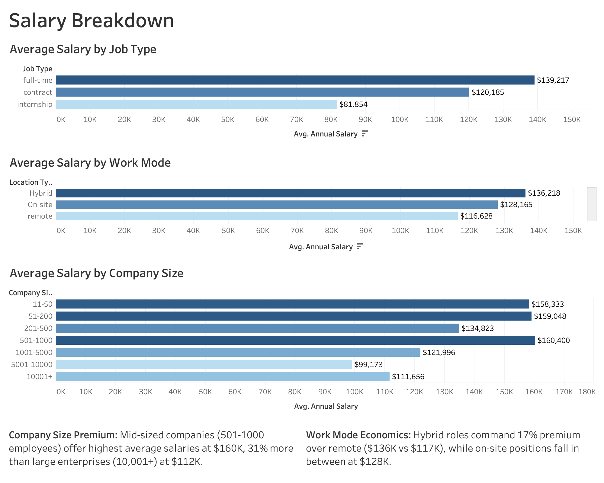

# **📊 JobFlow: Job Application Intelligence Platform**

> A full-stack job tracking system with integrated market analytics dashboard built to optimize my data role job search strategy

[](https://github.com/ethantsaox/JobFlow)
[](https://linkedin.com/in/ethandtsao)

---

## **🎯 Project Overview**

**JobFlow** is a comprehensive job search intelligence platform I built with the help of AI to transform my job hunting process from reactive to data-driven. The system combines a full-stack application for tracking applications with an advanced analytics dashboard for market insights.

**Key Achievement:** Tracked 80+ applications across 86 companies, performing in-depth analysis using advanced SQL queries and through Tableau dashboards.

---

## **📁 Project Structure**

```
JobFlow/
├── frontend/          # React application
├── backend/           # FastAPI server
├── database/          # PostgreSQL schema & migrations
├── analytics/         # Python ETL scripts
├── tableau_exports/   # CSV files for Tableau
└── dashboards/        # Tableau workbooks (.twbx)
```

---

## **✨ Features**

### **1. Full-Stack Application**
- 📝 **Application Tracking:** Comprehensive job application management system
- 🎯 **Smart Categorization:** Automatic job role classification (Data Engineer, Data Scientist, Data Analyst)
- 💰 **Salary Intelligence:** Automatic salary parsing and standardization across formats
- 🏆 **Gamification:** Achievement system with milestones and streak tracking
- 📊 **Real-time Analytics:** Dashboard with KPIs and progress visualization
- 🔍 **Advanced Filtering:** Search and filter by status, company, location, salary range

### **2. Market Intelligence Dashboard (Tableau)**
- 📈 **Market Overview:** Job category distribution, salary analysis, work mode trends
- 🛠️ **Skills Intelligence:** Heatmap showing skill requirements by role
- 💵 **Compensation Analysis:** Salary breakdown by company size, work mode, and skills
- 🏢 **Industry Insights:** Top hiring industries and salary comparisons

---

## **🖼️ Application Screenshots**

### **Dashboard Overview**

*Main dashboard showing application progress, streaks, and achievements*

### **Application Management**

*Comprehensive application tracking with company details, salary info, and status updates*

### **Analytics Dashboard**

*Deep insights into application timeline, status distribution, and success metrics*

### **Network & Achievements**

*Gamification features with milestone tracking and achievement system*

### **Application Details**

*Detailed view of individual applications with notes and job descriptions*

### **LinkedIn Integration**

*Browser extension integration for one-click job tracking from LinkedIn*

---

## **📊 Tableau Dashboard**

### **Page 1: Market Overview**


**Key Insights:**
- Data Engineer roles comprise 33% of the market
- Average salary: $129K (range: $48K-$330K)
- 75% of jobs require Python
- Full-time positions dominate at 75%
- Remote work accounts for 36% of opportunities

### **Page 2: Skills Intelligence**


**Key Findings:**
- **Universal Skills:** Python (75%) and SQL (70%) are non-negotiable
- **Data Science:** 100% require ML, 65% require Statistics
- **Data Engineering:** 65% require ETL, 50% require Snowflake
- **Data Analyst:** 71% require Business Intelligence tools

### **Page 3: Salary Breakdown**


**Salary Drivers:**
- Mid-sized companies (500-1K employees) pay highest: $160K avg
- Hybrid work commands 17% premium over remote
- Full-time roles pay 14% more than contract positions

### **Page 4: Industry Breakdown**


**Industry Insights:**
- Software dominates at 63% of opportunities (50 positions)
- Technology sector commands premium compensation at $135K average
- Manufacturing emerging as secondary market at 11% (9 positions)
- Consulting balances accessibility with competitive pay at $96K average

**Strategic Recommendations:**
- Target Software/Technology industries for 71% of market opportunities
- Mid-sized tech companies offer optimal compensation ($160K average)
- Pursue hybrid and on-site roles for 17% salary premium over remote
- Develop Airflow/Snowflake expertise for Data Engineering differentiation

---

## **💻 SQL Analytics Queries**

The market intelligence insights are powered by 8 core SQL queries analyzing job market patterns across 80+ applications.

### **Query Overview**

| Query | Purpose | Key Metrics |
|-------|---------|-------------|
| **Market Overview** | Dataset summary statistics | Total jobs, companies, salary range |
| **Role Distribution** | Job category breakdown | Market share %, avg/median salary by role |
| **Skills Demand** | Universal skill requirements | Percentage of jobs requiring each skill |
| **Skills Heatmap** | Role-specific skill patterns | Skill requirements by job category |
| **Company Size** | Compensation by company scale | Average salary across company sizes |
| **Work Mode Analysis** | Remote/Hybrid/On-site trends | Market share % and salary by work mode |
| **Industry Trends** | Sector concentration | Top 10 industries by job count |
| **Skill-Salary Link** | High-value skills | Salary premium for specialized skills |

### **Sample Queries**

<details>
<summary><b>Query 1: Market Overview</b></summary>
```sql
SELECT 
    COUNT(*) as total_jobs_analyzed,
    COUNT(DISTINCT company_name) as unique_companies,
    ROUND(AVG(annual_salary), 0) as avg_salary,
    MIN(annual_salary) as min_salary,
    MAX(annual_salary) as max_salary
FROM job_applications
WHERE annual_salary IS NOT NULL;
```

**Output:** 80 jobs, $129K average salary ($48K-$330K range)

</details>

<details>
<summary><b>Query 2: Role Distribution & Salary</b></summary>
```sql
SELECT 
    job_category,
    COUNT(*) as job_count,
    ROUND(100.0 * COUNT(*) / SUM(COUNT(*)) OVER(), 1) as market_share_pct,
    ROUND(AVG(annual_salary), 0) as avg_salary,
    ROUND(PERCENTILE_CONT(0.5) WITHIN GROUP (ORDER BY annual_salary), 0) as median_salary
FROM job_applications
WHERE annual_salary IS NOT NULL
GROUP BY job_category
ORDER BY job_count DESC;
```

**Insight:** Data Engineer roles dominate at 33% market share

</details>

<details>
<summary><b>Query 3: Universal Skills Analysis</b></summary>
```sql
SELECT 
    'Python' as skill,
    SUM(skill_python) as jobs_requiring,
    ROUND(100.0 * AVG(skill_python), 1) as percent_of_market
FROM job_applications
UNION ALL
SELECT 'SQL', SUM(skill_sql), ROUND(100.0 * AVG(skill_sql), 1)
FROM job_applications
UNION ALL
SELECT 'Machine Learning', SUM(skill_machine_learning), ROUND(100.0 * AVG(skill_machine_learning), 1)
FROM job_applications
-- [Additional skills...]
ORDER BY jobs_requiring DESC;
```

**Finding:** Python (75%) and SQL (70%) are non-negotiable baseline skills

</details>

<details>
<summary><b>Query 4: Skills Heatmap by Role</b></summary>
```sql
SELECT 
    job_category,
    ROUND(100.0 * AVG(skill_python), 0) as python_pct,
    ROUND(100.0 * AVG(skill_sql), 0) as sql_pct,
    ROUND(100.0 * AVG(skill_machine_learning), 0) as ml_pct,
    ROUND(100.0 * AVG(skill_etl), 0) as etl_pct,
    ROUND(100.0 * AVG(skill_business_intelligence), 0) as bi_pct
FROM job_applications
GROUP BY job_category
ORDER BY job_category;
```

**Discovery:** 100% of Data Science roles require ML, 71% of Analyst roles need BI tools

</details>

<details>
<summary><b>Query 5: Company Size Compensation Paradox</b></summary>
```sql
SELECT 
    company_size,
    COUNT(*) as job_count,
    ROUND(AVG(annual_salary), 0) as avg_salary
FROM job_applications
WHERE company_size != 'Unknown' AND annual_salary IS NOT NULL
GROUP BY company_size
ORDER BY avg_salary DESC;
```

**Key Finding:** Mid-sized firms (500-1K) pay $160K—31% more than enterprises

</details>

<details>
<summary><b>Query 6: Work Mode Economics</b></summary>
```sql
SELECT 
    location_type,
    COUNT(*) as job_count,
    ROUND(100.0 * COUNT(*) / SUM(COUNT(*)) OVER(), 1) as percent_of_market,
    ROUND(AVG(annual_salary), 0) as avg_salary
FROM job_applications
WHERE location_type IS NOT NULL AND annual_salary IS NOT NULL
GROUP BY location_type
ORDER BY avg_salary DESC;
```

**Result:** Hybrid work commands 17% salary premium over remote positions

</details>

<details>
<summary><b>Query 7: Industry Concentration</b></summary>
```sql
SELECT 
    industry,
    COUNT(*) as job_count,
    ROUND(100.0 * COUNT(*) / SUM(COUNT(*)) OVER(), 1) as market_share_pct,
    ROUND(AVG(annual_salary), 0) as avg_salary
FROM job_applications
WHERE industry IS NOT NULL AND annual_salary IS NOT NULL
GROUP BY industry
ORDER BY job_count DESC
LIMIT 10;
```

**Insight:** Software/Tech represents 71% of data role opportunities

</details>

<details>
<summary><b>Query 8: Skill-Salary Correlation</b></summary>
```sql
SELECT 
    'Snowflake' as skill,
    ROUND(AVG(CASE WHEN skill_snowflake = 1 THEN annual_salary END), 0) as avg_with_skill,
    ROUND(AVG(CASE WHEN skill_snowflake = 0 THEN annual_salary END), 0) as avg_without_skill,
    ROUND(AVG(CASE WHEN skill_snowflake = 1 THEN annual_salary END) - 
          AVG(CASE WHEN skill_snowflake = 0 THEN annual_salary END), 0) as salary_premium
FROM job_applications
WHERE annual_salary IS NOT NULL
UNION ALL
SELECT 'Airflow', [...], [...], [...]
-- [Additional specialized skills...]
ORDER BY salary_premium DESC;
```

**Discovery:** Snowflake/Airflow expertise correlates with $162K+ compensation

</details>

### **Full Query Set**

📁 **Location:** [`/database/analytics_queries.sql`](database/analytics_queries.sql)

All 8 queries are available in the repository with detailed comments explaining their purpose and expected outputs. These queries power the Tableau dashboards and can be run directly against the PostgreSQL database.

---

## **🛠️ Technical Stack**

### **Frontend**
- **Framework:** React 18
- **State Management:** React Context API
- **Routing:** React Router v6
- **Styling:** CSS Modules + Modern CSS
- **HTTP Client:** Axios
- **UI Components:** Custom components with responsive design

### **Backend**
- **Framework:** FastAPI
- **Database:** PostgreSQL 14
- **ORM:** SQLAlchemy
- **Authentication:** JWT tokens
- **API Documentation:** OpenAPI/Swagger (auto-generated)

### **Analytics Pipeline**
- **ETL:** Python 3.11
- **Data Processing:** Pandas
- **Text Analysis:** Regex + NLP for skill extraction
- **Visualization:** Tableau Desktop 2025.3
- **Exports:** CSV format for Tableau integration

---

## **📊 Key Insights & Learnings**

### **Market Intelligence**
1. **Skills Hierarchy:** Python + SQL are table stakes (70%+ of jobs)
2. **Company Size Paradox:** Mid-sized firms pay 31% more than enterprises
3. **Work Mode Economics:** Hybrid roles command 17% salary premium
4. **Industry Concentration:** Software/Tech represents 71% of opportunities

### **Technical Learnings**
1. **Data Quality:** Salary parsing required handling 10+ different formats
2. **Job Classification:** Order matters - check specific categories before broad ones
3. **Skill Extraction:** Simple regex outperformed complex NLP for structured data
4. **Dashboard Performance:** Pre-aggregated data dramatically improved Tableau load times

### **Job Search Strategy**
- **Target Profile:** 500-1K employee companies, hybrid roles, Software/Tech industry
- **Skill Investment:** Master Python/SQL, then specialize in BI Tools for Data Analysis
- **Application Velocity:** 2.7 apps/day average, peaking at 7 apps/day during active periods

---

## **🔮 Future Enhancements**

### **Planned Features**
- [ ] Machine learning model to predict application success
- [ ] Automated email parsing for status updates
- [ ] Chrome extension for one-click application tracking
- [ ] Integration with Glassdoor API for company reviews
- [ ] Network visualization of company connections
- [ ] Automated cover letter generation using GPT-4

### **Technical Improvements**
- [ ] Add Redis caching layer
- [ ] Implement real-time WebSocket updates
- [ ] Add comprehensive test suite (Jest + Pytest)
- [ ] Set up CI/CD pipeline with GitHub Actions
- [ ] Containerize with Docker
- [ ] Add Prometheus + Grafana monitoring

---

## **🤝 Contributing**

This is a personal project, but I'm open to suggestions! Feel free to:
- Open an issue for bugs or feature requests
- Submit a pull request with improvements
- Share your own job search data for anonymized analysis

---

## **📄 License**

MIT License - feel free to use this project as inspiration for your own job search tools!

---

## **👤 About Me**

**Ethan Tsao**  
Statistics & Data Science @ UCSB | Graduating June 2026

I built JobFlow to solve my own problem: turning the chaos of job hunting into actionable data. This project combines my interests in full-stack development, data engineering, and visual analytics.

**Connect with me:**
- 💼 [LinkedIn](https://linkedin.com/in/ethandtsao)
- 🐙 [GitHub](https://github.com/ethantsaox)

---

## **🙏 Acknowledgments**

- **Inspiration:** Frustrated by scattered job application tracking across spreadsheets
- **Data Source:** My own 80+ job applications (Dec 2025 - Jan 2026)
- **Tools:** React, FastAPI, PostgreSQL, Tableau, Python, lots of green tea 🍵

---

**⭐ If this project helped you, please star the repo!**

---

*Last Updated: January 2026*

---
